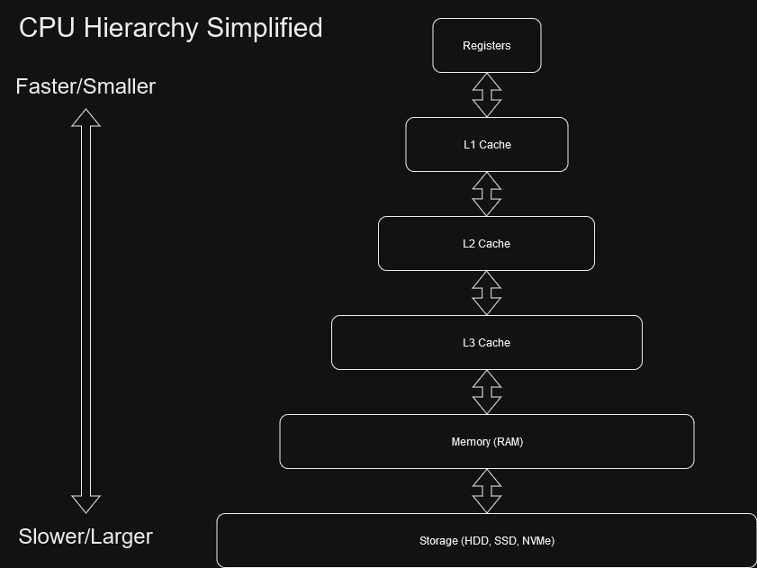
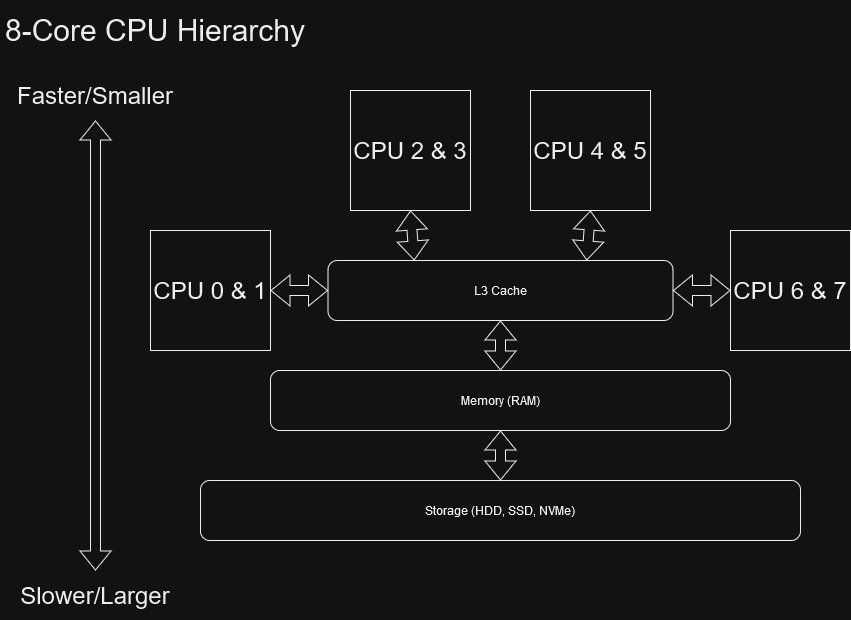

# 1️⃣ Memory Hierarchies, Computational Graphs and Compilers
Not all efficiency comes from optimizing the various computational details like multiplications, divisions
and such of a function.
Quite a large part of it, in fact, comes from optimizing how much you write to and read from memory.
'Which memory?' you might ask, rightfully. The answering the where, when and what of memory will be
the focus of this module. We can almost always get more cores to throw at a problem, we can also,
at least on the CPU, quite easily get more memory, but that does not change the amount of time it takes
to get a piece of memory, only how much data we can have in memory before we have to go to a lower level,
e.g. go from RAM to disk. This is even more important given the relatively slow improvement of memory over time.
<figure markdown>
{ width="500" }
<figcaption>
<a href="https://www.cs.umd.edu/~meesh/411/CA-online/chapter/memory-hierarchy-design-basics/index.html">
Image credit</a>
</figcaption>
</figure>

## Perspective
The further you move from simple, albeit heavy, problems such as a matrix-matrix problem to more heterogenous
problems, such as training a neural network, the harder it can be to get good performance. How do you know or
reason about what is where when in complex systems like
[PyTorch](https://pytorch.org/), [Tensorflow](https://www.tensorflow.org/),
[JAX](https://jax.readthedocs.io/en/latest/), [Numba](https://numba.pydata.org/) and
[Taichi](https://www.taichi-lang.org/). All of these frameworks, compilers and domain specific languages have to
nudge you in different directions to give them the restrictions and hints needed to let them run your code
as efficiently as possible. Nudges like defining your neural network as a computational graph. If you're unsure
about what a computational graph is, the basic version is that you define a bunch of operations and how they relate
to each other. Like input layer, followed by linear layer, followed by ReLU. But more on that later! Other advances
include PyTorch, after several attempts with various degrees of success, finally introducing a
[compiler](https://pytorch.org/tutorials/intermediate/torch_compile_tutorial.html) for optimizing the
neural network you just defined.
Or the functional programming style used by
[JAX](https://jax.readthedocs.io/en/latest/notebooks/Common_Gotchas_in_JAX.html) in conjunction with
the [XLA compiler](https://www.tensorflow.org/xla).

## Memory Hierarchies
So what is memory anyways? Memory in a compute context is represented in several stages, all having
their own capacity and speed.
In order from smallest capacity and highest speed to largest capacity and lowest speed we have
the registers, the L1-L3 caches, the main memory (RAM) and the disks.
The registers are the fastest and smallest of the bunch. They reside right next to the parts of
the CPU that does the computations.
As a rule of thumb, most of the variables you declare in the scope of your function, unless
there is A LOT of variables, will be kept in registers. The caches and the main memory all work
in conjunction with each other as an invisible way of speeding up the accesses to the main memory.

<figure markdown>
{ width="500" }
<figcaption>
A simplified view of the CPU memory hierarchy.
</figcaption>
</figure>

Say you load in a file from the disk. If small enough, that entire file can be kept in memory.
Which is great! We could keep all of the values in a great big array which we
could access, like ```current_value = data[index]```. But if you just wanted to read the first 5 values in the file
in a loop, it would be incredibly slow to load those 5 values over and over again all the way from memory.
What happens instead is that those 5 values might have separate copies in the L3, L2 and L1 caches, perhaps even in
the registers. That would speed up things greatly. Whenever we asked for the first value we would first ask the
L1 cache, do you have this value? If yes, that would be a cache hit, and we would pay a small amount of time to
retrieve the value. If the L1 cache did not have a valid copy of the value, we would ask the L2 cache, and so on
and so on, until we reach memory. If our file was too big to fit in memory, the operating system might even
virtualize (don't worry about it) the memory and go all the way to the disk or to the internet to retrieve our value.
Which is just as slow as it sounds.

<figure markdown>
{ width="500" }
<figcaption>
An example view of what CPU memory hierarchy can look like with 2 cores.
</figcaption>
</figure>

To further complicate things, multicore CPU's have each CPU sharing the disk, memory and L3 cache, sometimes they also share
the L2 cache with a few other CPUs.
We are also at risk of each core not just reading from the same values, but what if some of them modified
one or more of the 5 values? At any point in time a value loaded from memory, to L3 cache, to L2 cache, to L1 cache,
to the registers of thread A, might be invalid because thread B wrote to that value. This may have updated
the value in memory and in thread B's registers, L1 and L2 caches, hopefully, it also updated it in an
L2 and/or L3 cache it shared with thread A, but even then we would still need to move the value from
L2/L3, to thread A's L1 cache and registers for it to be valid. Which is probably not happening.
Multiple threads reading from a piece of data, which one or more threads are writing to is also known as a
[data race](https://www.brainkart.com/article/Data-Races_9445/).
Most likely thread A will end up with a stale version of the data and will continue as if the value
had never been modified.
Thread A will then write its own new version of the value, or just be working off an old version, resulting in
incorrect results.

<figure markdown>
{ width="500" }
<figcaption>
An example view of what CPU memory hierarchy can look like with 8 cores.
</figcaption>
</figure>

Nudging the programmer (that's you!), to better define your program, not just line-by-line, but as a whole,
to constrain these sorts of contentions, is one of the myriad reasons why
frameworks like PyTorch can greatly speed up your code, if you help it along.

For a more in-depth explanation on the memory hierarchy see this chapter on
[Memory Hierarchy Design](https://www.cs.umd.edu/~meesh/411/CA-online/chapter/memory-hierarchy-design-basics/index.html).

## Expanding the Memory Hierarchy
To top it off we can expand this memory hierarchy with additional components, such as accelerators, networking
and the internet!
Let's start off with the GPU. It is an accelerator originally made for just computing graphics as fast as
possible. It has a whole bunch of threads in it, meaning it can do very parallel work, like making every pixel
of an image slightly darker. At the end of the 2000's, Nvidia saw a bunch of academics hacking the GPU to do
stuff like fast fourier transforms using the fragment shader. Don't worry about what that is, but shader
basically means GPU program. So Nvidia releases CUDA as a pure compute (no graphics) API for using your GPU.
It only runs on Nvidia GPU's though. Transfering memory from the CPU to the GPU and back, can be a
quite explicit process. Not only does the CPU need to reserve some memory for copying to the GPU,
the CPU and GPU have to be synchronized which can take a while, and then the data is usually transferred
across the slower (compared to memory and cache) PCIe bus. It is certainly one you should always be thinking
about if you are using a GPU for your program. Neglecting transfers is one of the fastest ways to your code
the slowest. The GPU also has its
[own memory hierarchy](https://developer.nvidia.com/blog/nvidia-hopper-architecture-in-depth/).

<figure markdown>
{ width="500" }
<figcaption>
<a href="https://developer.nvidia.com/blog/nvidia-hopper-architecture-in-depth/">
Image credit </a>
</figcaption>
</figure>

As you can see, this being representative of the Nvidia H100, there are 2 L2 caches and a
whole bunch of smaller sections. Each of these smaller sections are a streaming multiprocessor (SM).

<figure markdown>
{ width="500" }
<figcaption>
<a href="https://developer.nvidia.com/blog/nvidia-hopper-architecture-in-depth/">
Image credit </a>
</figcaption>
</figure>

Here we have an L1 data cache and shared memory (more on shared memory later), shared between 128 threads.
Each of these warps, Nvidia terminology for one of these four sections, have 32 threads with an L0 instruction
cache, which is not matched for data. Additional accelerators exist, such as the neural engine featured in
quite a lot of Apple products, and dedicated image and video processing hardware.

Finally, you can even go outside of your current system. Two CPU's and eight GPU's could be tightly
interconnected in a node, such as in the
[Nvidia DGX system](https://www.nvidia.com/en-us/data-center/dgx-a100/). In the case of a DGX system
everything is tightly interconnected with specialized hardware to minimize the time it takes to
transfer data from one component to the other.

Taking things even further we could be sending data between more than one node, requiring yet another layer of
communication, which is going to be slower than communicating internally in your CPU or in your node.
When running on clusters with multiple nodes, the data you work from might have to be fetched from one
or more storage nodes, which keeps your data between batch jobs. Taking neural network training as an example,
if your data set is small enough to keep fully on the compute node you only need to load the dataset to the
compute node before you begin training. Even better, the data set can be small enough that it fits, along
with your model, completely on the GPU, meaning less transfers, less communication and better performance.

If you wanted to make things worse however, and have your local systems administrator put you on speed dial,
you would fetch your entire data set from the internet every time you launched a job. I am absolutely
certain no one has ever just downloaded a Hugging Face data set whenever they launched a job...
The internet can in this way be thought of as yet another, even slower, component of the memory hierarchy.
Not much good comes from the internet. Try to avoid it. Except for this guide of course, which is very helpful.

<figure markdown>
{ width="500" }
<figcaption>
<a href="http://www.quickmeme.com/meme/3rmoyk">
Image credit </a>
</figcaption>
</figure>

## Wrapping Things Up
Hopefully, this teaser hasn't scared you away from charging ahead and learning more about memory hierarchies
and computational graphs. Memory hierarchies are at the center of getting good performance in pretty much
all programs and it is worth spending some time on having at least a tenuous grasp of how to use them.
