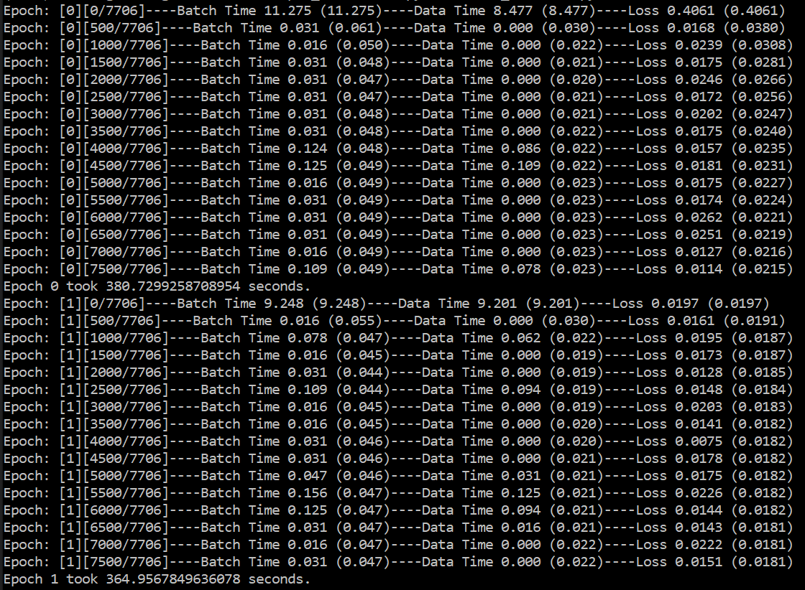
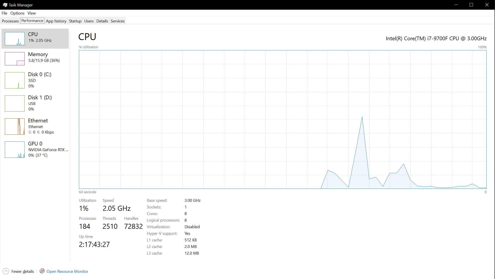
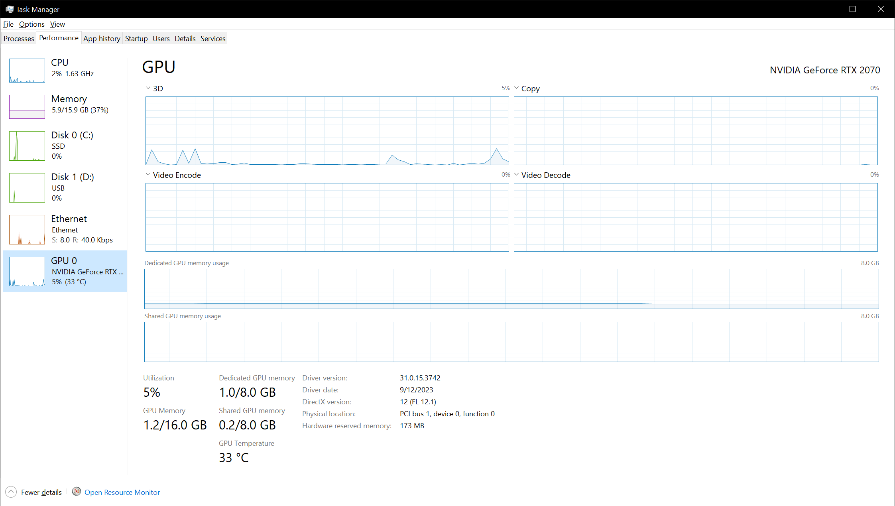
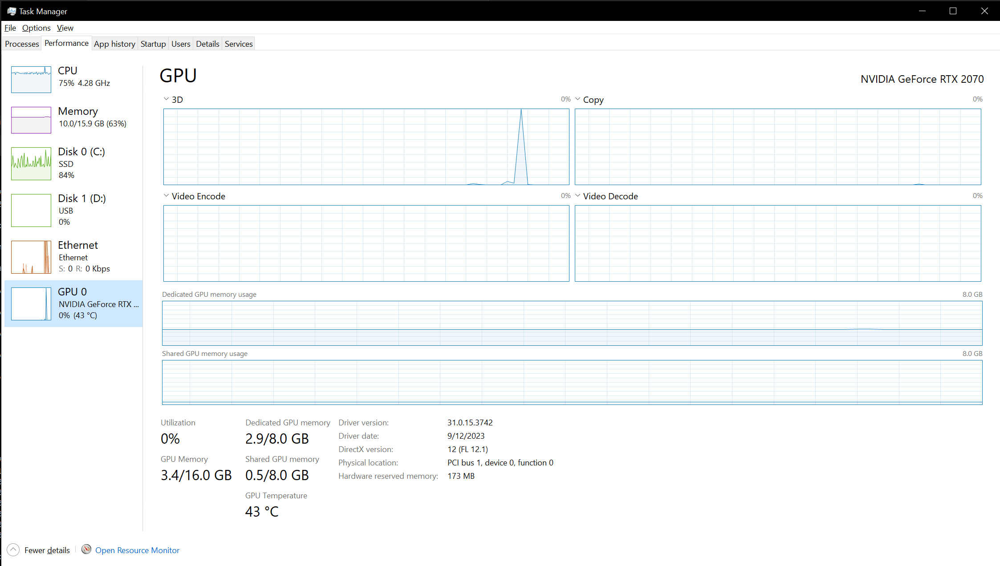
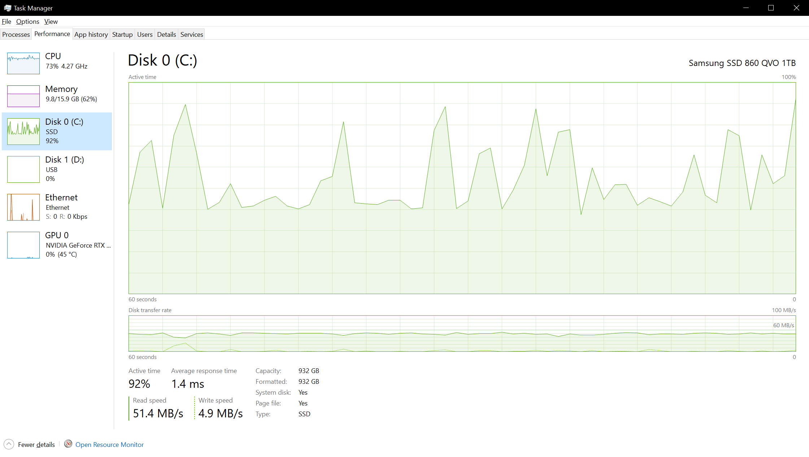
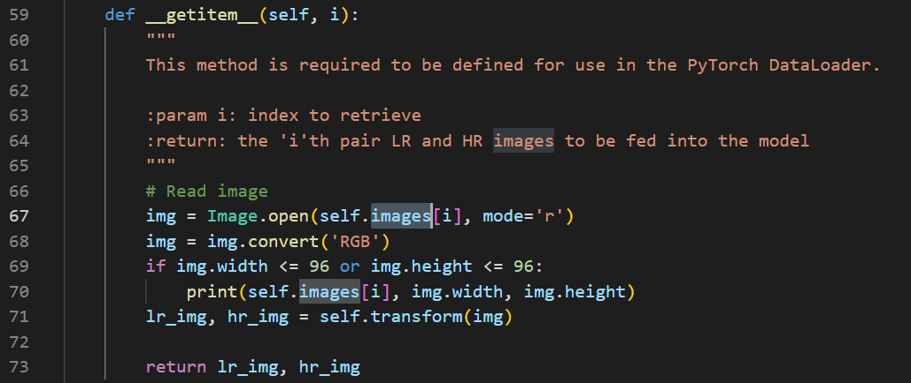
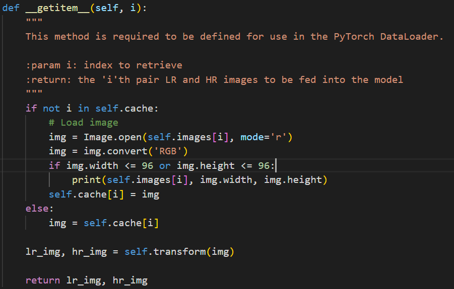

# 🧬3️⃣ Optimizing Deep Learning Training
Now, let's go through a small example of optimization through picking the lowest hanging fruits.
I'll do this on a different system, why will make sense later. This system has an
Nvidia RTX2070 GPU with 8 GB of VRAM, 16 GB of 2666MHz RAM, 1TB SSD (not NVMe) disk and
an Intel i7-9700F CPU with 8 cores and a base speed of 3.0 GHz. The operating system
is Windows 10.

On to the actual case. I found a very nice tutorial about how super resolution networks.
They take in a lower resolution image and produce another image with a higher resolution.
I won't link to the tutorial, although the original author is very welcome to contact me
and approve, in which case I of course will. I won't link to it as I don't want to risk
this case study coming off as shaming or finger pointing. Performance wasn't the goal
of the tutorial, it was to teach the reader about super resolution networks, which it does
very well.

Anyways, in the tutorial there are two different networks to train. Either a super resolution
GAN or a super resolution ResNet. I chose the ResNet. The data set is 13 GB for training and
6 GB for validation. Normally, I would expect to see the epoch, where you might recall we will
sample the entire training data set, get faster after the first one, as more data is loaded from
disk. There is a snag which can make optimization of this problem difficult. We usually random
sample batches from the entire training data set.
Finally, we are limited by being unable to fit the entire training data set in either type of RAM.

To start, let's run the code for two epochs and see what the run time is.

<figure markdown>
{ width="800" }
<figcaption>
The baseline timing for running two epochs.
</figcaption>
</figure>

So, we ran two epochs and it is murderously slow. The timing did not improve noticeably for the second
epoch. Let's go over to task manager and look at the system's characteristics before we rerun the
two epochs.

<figure markdown>
{ width="800" }
<figcaption>
The system baseline in the CPU tab.
</figcaption>
</figure>

<figure markdown>
{ width="800" }
<figcaption>
The system baseline in the GPU tab.
</figcaption>
</figure>

We can see not a lot of stuff is going on aside from small peaks here and there. Our baseline RAM is
5.8 GB and on the GPU we use just about 1 GB. Let's run two epochs and see what comes out.

<figure markdown>
{ width="800" }
<figcaption>
The CPU tab during unoptimized training.
</figcaption>
</figure>

<figure markdown>
{ width="800" }
<figcaption>
The GPU tab during unoptimized training.
</figcaption>
</figure>

<figure markdown>
{ width="800" }
<figcaption>
The disk tab during unoptimized training.
</figcaption>
</figure>

As you can see, where are not maxing out the RAM or VRAM, the GPU is barely doing anything, but using
a total of 3GB VRAM now. Additionally, we can see that we are at a total of 10 GB RAM used, with a
reasonably heavy load on both disk and CPU. There aren't performance statistics for the memory,
but my guess is that it is covered by the CPU usage as well. Time spent waiting for memory access
is probably covered in the CPU load. So let's take a look at the data loader.

<figure markdown>
{ width="800" }
<figcaption>
The data loader.
</figcaption>
</figure>

It does some setup, but most importantly... it doesn't reuse data. It ALWAYS reloads it from
disk and redoes some preprocessing. In a perfect world, we would keep the entire data set
loaded on the GPU, at which point we would probably optimize the GPU compute part, but what
could we do about the disk and CPU load? While we could make a more complex hierarchical
data loader which kept track of which data was on the GPU, which data was in memory and
which was on disk, this is more work than I have time for, and given the randomized data
set sampling, the probability of getting a "cache hit" on the GPU is around 1/3 at the start
of an epoch and decreasing over time. Short of upgrading to a GPU with more RAM or compressing
and preprocessing the data, there are probably other and cheaper low hanging fruit. And by
cheap I mean either in money or in your/my time. Which is also a valuable resource. Instead
I propose the following: upgrade the RAM and cache the data. Upgrading the RAM to an amount
that allows us to keep most or all of the data set in memory will allow us to write a data cache.
We will still only load the data on demand, but first we will look in our list of loaded data,
if it is not in the cache, we will load the data from the disk and preprocess it.
Then we will put the data in our cache after which we will yield the data. We save the preprocessing
and hopefully significantly decrease the load on our disk.

Currently, I have two 8 GB sticks of 2666 MHz RAM in the machine. I will now shut off the system
and replace the two sticks with a single 32 GB stick. Also running at 2666 MHz, because that's
the greatest speed my motherboard will allow. So hold on while I do that.

Ok, so I installed the 32 GB stick and changed the data loader to lazy caching. As it turns out
it ends up using around 64 GB if you want to cache all of the data. The new function looks like this -

<figure markdown>
{ width="800" }
<figcaption>
The data loader.
</figcaption>
</figure>

This results in a severe amount of thrashing where a part of the memory is kept on disk and a
continual swapping between memory and disk and disk and memory takes place, which absolutely
tanks performance. Let's see whether putting in another stick of RAM yields better results.
